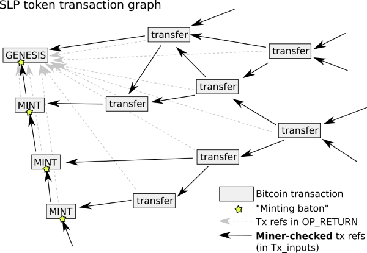

# Simple Ledger Protocol 

## A token system for Bitcoin Cash

# Authors:

****Jonald Fyookball, James Cramer, Unwriter, 
Mark B. Lundeberg, Calin Culianu, Ryan X. Charles**

**
**

**Table of Contents**

**SECTION I: BACKGROUND**

**	**

**Introduction**

**	Summary**

**	Use Cases**

**	Requirements
	Comparison to Other Token Schemes
	Design Philosophy and Challenges**

**
****SECTION II: PROTOCOL DESCRIPTION**

**
	Protocol Overview**

**	Consensus Model**

**	Consensus Rules**

**	Transaction Detail**

**	Transaction Validation Security Model**

**	Token Addresses

****SECTION III: FURTHER ANALYSIS
**

**	 Wallet Implementation**

** Proxies****
          ****Economic Implications**

**
****APPENDICES**

**Appendix A: Regulated Security Tokens**

**SECTION I: BACKGROUND
****

# Introduction

We begin with the premise that Bitcoin Cash needs a system for handling tradable or redeemable tokens.  We base this premise on the myriad of possible use cases and the billions of dollars of market capitalization that currently exist on platforms such as Ethereum.

Despite the demand, enhancement proposals such as GROUP or OP_GROUP have not achieved enough consensus to meet the high bar required for changing the Bitcoin Cash base protocol layer.  Nor have there been any non-protocol proposals with sufficient traction.

Therefore, we are motivated to present our own solution.  The key to its potential success lies in its simplicity, but will also depend on our taking action to foster the support of the ecosystem.

# Summary

Simple Ledger Protocol (SLP) uses the meta data in OP_RETURN for the issuance and transfer of tokens in conjunction with standard transaction outputs that each represent a number of token units specified by the sender. Consensus on the interpretation of the OP_RETURN outputs is achieved by token users and market participants adhering to a prescribed set of simple rules. 

Because SLP builds on the transaction chain of the existing Bitcoin framework, users can easily verify transactions with SPV/lite wallets within practical boundaries.  Full validation of a transaction back to its token genesis is possible by supplementing existing transaction-retrieval infrastructure with integration of SLP consensus rules.

# Use Cases
**

A plethora of use cases for tokens has been detailed by others and does not require a long discussion here.   Uses include stocks, securities, registries, smart properties, utility tokens, contracts, coupons, bonds, demand deposits, local currencies, representation of physical assets, and many more. 

# Requirements

We believe that a good solution for implementing tokens should have the following properties:

**1. Permissionless**. Its tokens should not require permission to issue or transfer.
**2. Simple**. The system should be easily understandable and straightforward.
**3. Robust.** A minimal, unambiguous rule set supports a fault-tolerant consensus layer.
**4. Non-invasive.** It should require no changes to the underlying Bitcoin Cash protocol.
**5. SPV friendly.** Users of lite wallets should be able to validate their own transactions.
**6. Extensible.** The system should allow future versions of tokens including tokens with issuer controlled whitelists for regulated securities ([Appendix A](#bookmark=id.t5t1povi0m8m)), and other needs.
**7. Supported.** There should be an implementation plan for rapid ecosystem support.

# Comparison to other token schemes

Before presenting the details of our proposal, it may be helpful to review previous and competing proposals.

In a perfect world, miners would validate tokens transactions, bringing the full Bitcoin security model to tokens.  However, this would require a protocol change like with the GROUP proposal.    Alternatively, a different kind of protocol change would allow a trustless linkage to flexible side-chains (such as RSK) upon which tokens may be built.

Absent miner-validation of tokens, it is necessary to add extra data onto ordinary  transactions that indicates coloring, transferred value, etc. The standard way to do this is with [OP_RETURN](https://en.bitcoin.it/wiki/Script#Provably_Unspendable.2FPrunable_Outputs) which allows cleanly holding arbitrary data. Unfortunately, any bitcoin user can post an apparent token-transfer transaction and have it confirmed by miners without actually owning tokens. Token conservation and any other desired rules must instead be enforced with user consensus alone, by examining the history behind each transaction and marking as ‘invalid’ those that do not follow the rules of its protocol.

Many implementations (including this proposal) fall under the category of "colored coins".   [Most of these designs actually supplement the transaction output (UTXO) with extra colored values](https://github.com/Colored-Coins/Colored-Coins-Protocol-Specification/wiki/Faq#coloring-satoshis): Surprisingly, only EPOBC (one of the earliest proposals) actually took bitcoins and applied color to them.

The advantage of these "colored coin" tokens is that the miners prevent double-spending. One disadvantage is that these UTXOs can be accidentally spent without the special color metadata, which is equivalent to discarding the tokens. This easily occurs if tokens are sent to someone with a regular (non-token-aware) bitcoin wallet. [Color addresses](https://github.com/chromaway/ngcccbase/wiki/Addresses) have been proposed to reduce these accidents.

Finally, some token schemes (Omni, Counterparty) discard the UTXO concept for tokens and instead associate an overall balance to an address. Transactions then serve only as a signed and irreversibly published order of balance transfer, and miners do not prevent double-spending of tokens. Users’ checking of transaction validity requires examining all prior transactions associated with the addresses involved, and this is sensitive to blockchain re-ordering. The [Tether](https://en.wikipedia.org/wiki/Tether_(cryptocurrency)) USD-pegged token was issued on Omni.

Since colored coins cannot be double spent, [one can prove](https://www.reddit.com/r/Bitcoin/comments/26mzbb/chromawallet_colored_coins_v007_beta_it/chsm1na/) the validity of a token transaction by examining only the input ancestor transactions tracing back to when the tokens were first minted. This set of transactions forms a [directed acyclic graph](https://en.wikipedia.org/wiki/Directed_acyclic_graph) (DAG). These proofs are significantly more weighty than SPV, yet still simple enough to implement in a lite client. In contrast, balance-based tokens in principle require a full node to achieve a high level of security: only after an examination of all transactions (to ensure inclusion of all at a given address), can valid transactions be proven.

Token implementations also vary in their scriptability, ranging from none at all (tokens can only be sent and received), to bitcoin-level (multisig, atomic swaps, payment channels possible), up to highly complex scripting languages like those implemented on the Ethereum cryptocurrency.

Here is a chart comparing primary token properties:

<table>
  <tr>
    <td>System</td>
    <td>Token value associated to...</td>
    <td>Transfer data is all on-chain?</td>
    <td>Lite proofs?</td>
    <td>Scriptability</td>
    <td>Adoption obstacles</td>
  </tr>
  <tr>
    <td>Omni</td>
    <td>Address</td>
    <td>Y</td>
    <td>no</td>
    <td>Bitcoin</td>
    <td>Ecosystem integration</td>
  </tr>
  <tr>
    <td>Counterparty</td>
    <td>Address</td>
    <td>Y</td>
    <td>no</td>
    <td>Complex</td>
    <td>Ecosystem integration</td>
  </tr>
  <tr>
    <td>EPOBC</td>
    <td>UTXO-outval</td>
    <td>Y</td>
    <td>DAG</td>
    <td>Bitcoin</td>
    <td>Lack of interest</td>
  </tr>
  <tr>
    <td>Coinspark</td>
    <td>UTXO</td>
    <td>N</td>
    <td>DAG</td>
    <td>Bitcoin</td>
    <td>Lack of interest</td>
  </tr>
  <tr>
    <td>Colu</td>
    <td>UTXO</td>
    <td>Y</td>
    <td>DAG</td>
    <td>Bitcoin</td>
    <td>Under evaluation</td>
  </tr>
  <tr>
    <td>Open Assets</td>
    <td>UTXO</td>
    <td>Y</td>
    <td>DAG</td>
    <td>Bitcoin</td>
    <td>Lack of interest</td>
  </tr>
  <tr>
    <td>Tokeda</td>
    <td>UTXO</td>
    <td>Y</td>
    <td>Sigs</td>
    <td>Bitcoin</td>
    <td>Incomplete draft</td>
  </tr>
  <tr>
    <td>SITO</td>
    <td>UTXO</td>
    <td>N</td>
    <td>DAG</td>
    <td>No</td>
    <td>Under evaluation</td>
  </tr>
  <tr>
    <td>RSK/etc.</td>
    <td>Sidechain</td>
    <td>N</td>
    <td>SPV</td>
    <td>Complex</td>
    <td>Protocol change (for trustless)</td>
  </tr>
  <tr>
    <td>GROUP</td>
    <td>UTXO-outval</td>
    <td>Y</td>
    <td>SPV</td>
    <td>Bitcoin</td>
    <td>Protocol change</td>
  </tr>
  <tr>
    <td>SLP</td>
    <td>UTXO</td>
    <td>Y</td>
    <td>DAG</td>
    <td>Bitcoin</td>
    <td>Under evaluation</td>
  </tr>
</table>

**Table 1. Token proposals and their properties**

Other aspects are noted below: how multiple tokens can interact (e.g., can they appear in the same transaction, allowing token-token direct swaps?); how much customization is available to token properties at issuance; and any other notable extras / unusual features.

<table>
  <tr>
    <td>System</td>
    <td>Multiple token handling</td>
    <td>Issuer tweaks</td>
    <td>Extras</td>
  </tr>
  <tr>
    <td>Omni</td>
    <td>Normally segregated</td>
    <td>Many</td>
    <td>DEX, bets, ...</td>
  </tr>
  <tr>
    <td>Counterparty</td>
    <td>Normally segregated</td>
    <td>Many</td>
    <td>DEX, bets, ...</td>
  </tr>
  <tr>
    <td>EPOBC</td>
    <td>In same tx</td>
    <td>None</td>
    <td>-</td>
  </tr>
  <tr>
    <td>Coinspark</td>
    <td>In same tx or same UTXO</td>
    <td>Some</td>
    <td>Legal contracts, token conservation</td>
  </tr>
  <tr>
    <td>Colu</td>
    <td>In same tx or same UTXO</td>
    <td>Some</td>
    <td>Rule engine</td>
  </tr>
  <tr>
    <td>Open Assets</td>
    <td>In same tx</td>
    <td>None</td>
    <td>-</td>
  </tr>
  <tr>
    <td>Tokeda</td>
    <td>Segregated</td>
    <td>Few</td>
    <td>Issuer permission required for transactions</td>
  </tr>
  <tr>
    <td>SITO</td>
    <td>Segregated</td>
    <td>None</td>
    <td>-</td>
  </tr>
  <tr>
    <td>GROUP</td>
    <td>Segregated</td>
    <td>Few</td>
    <td>Yes, if even more opcodes.</td>
  </tr>
  <tr>
    <td>SLP</td>
    <td>Segregated</td>
    <td>Few</td>
    <td>-</td>
  </tr>
</table>

**Table 2. Additional token properties**

# Design Philosophy and Challenges 

Understanding the thinking behind the SLP protocol may assist in its evaluation.  

**Simplicity and Consensus
**
Our most formative principle is that of simplicity.  We found most of the previous attempts to introduce Bitcoin token proposals to be overcomplicated, which hinders both community support as well as implementation efforts and integration.

But there is an even more important reason to keep things as simple as possible, and that is to facilitate consensus.  The base layer of Bitcoin can accommodate a complex set of consensus rules because Proof-of-Work ensures high byzantine fault tolerance.  In other words, if miners’ implementations do not agree, the incompatibility is revealed quickly and the non-integrous data is expunged.  

By contrast, meta data is not miner validated and there is no clear separation between valid and invalid data.  This creates an environment of low fault tolerance.  For token schemes that rely on central authorities or signers, this is not necessarily an issue.  However, for permissionless systems like SLP, the only apparent way to mitigate this problem is to keep the rules simple and clear.

**Why SPV-friendly permissionless tokens are difficult
**
Without modifying the base Bitcoin protocol, supporting SPV wallets is challenging.  This is because valid Bitcoin transactions are committed to the blockchain, but second-layer transactions are not.  Thus, you cannot use the SPV security technique of checking the merkle branch to ensure the transaction is included in a block.
 
To prove a token transfer is valid, it is necessary to validate all prior transfers starting with the token genesis.  It would be advantageous to validate a token transaction with a high degree of certainty using only a subset of prior transactions.  Unfortunately, this does not appear possible because an attacker can cheaply create a chain of transactions to fool a recipient into believing an incoming transaction is valid when it is not.

We considered the possibility of attempting to prevent this attack with various commitment schemes, requiring transactions to point back to prior transactions.  However, this idea is ineffective because all links can be spoofed, regardless of whether they pointed to fake transactions on the false chain or real transactions on the valid chain. Thus, foul play would only be detectable at the exact place of divergence, which could be anywhere.  

**Hybrid Security Model**

Other various commitment schemes were considered and discarded.  Finally, we concluded that the simplest solution is best:  Users can validate the transfer of token ownership as far back as they choose, with the understanding that if they do not verify completely then it is theoretically possible for an attacker to create a longer attack chain. 

It is an acceptable limitation to have partial SPV-compatible validation, IF it is supplemented with an infrastructure-based solution providing full validation.  We will discuss the security model in detail in a subsequent section.

**SECTION II: PROTOCOL DESCRIPTION**

 

# Protocol Overview
**

The protocol defines 4 types of token transactions, which are contained within the OP_RETURN meta data of standard Bitcoin Cash transactions.  

The first 2 token transaction types (genesis and minting) define and issue the token.  The third transaction type is the most common (send); it allows users to transfer tokens. 
The final transaction type (checksum commitment) is a supplement to the basic consensus model.

The protocol also defines 4 consensus rules that determine the validity of a token send transaction (see Consensus Rules section below).

Rather than coloring coins directly, SLP represents one or more token units with a BCH unspent output.  Since Bitcoin transactions usually have multiple outputs, the OP_RETURN message must specify how many tokens are being assigned to which outputs.  

SLP transactions can contain multiple inputs and outputs which typically would correspond to those in the Bitcoin transaction they are carried in (although its possible to have additional *non*-SLP inputs and outputs in the same transaction).  Note that you cannot send multiple *types* of SLP tokens in the same transaction.  Also, it is possible to lose tokens if a token-containing output is improperly spent.

# Consensus Model  

SLP utilizes a model that could be described as **_Proof-of-Work / Proof-of-Trust_**.   

Meta data, while prunable, is still part of Bitcoin blocks -- timestamped and ordered in the immutable ledger via Proof-of-Work. However, like most OP_RETURN based approaches, what SLP sees as valid data is not segregated from what it considers invalid.  Although unambiguously ordered to prevent double-spending, the data must be filtered according to a set of rules that all participants agree on.

In many ways, this is not different than how Bitcoin itself operates.  Users must stay together on the same set of consensus rules to maintain their network effect.  The possibility to diverge is always present, with the market being the ultimate judge of how much value each ruleset holds.

In a pure Proof-of-Work model, byzantine fault tolerance is achieved via economic incentives combined with incompatible-by-design sets of data.  By contrast, SLP relies on a minimalistic set of rules overlayed onto the support of the PoW backbone.   

With transaction ordering taken care of by the underlying Bitcoin Cash blockchain, users simply have to use the same rules as a matter of convention.  Those rules will be defined by the concordance of:

a) this specification

b) a reference implementation (perhaps BitDB)

c) token issuers

**Checksum commitments **

Token issuers should publish periodic hash commitments of valid transactions in accordance with this specification, which provides a "Proof of Trust". 

It is important to understand that the checksums are part of the overall consensus model but are **NOT** part of the consensus *rules* per se.   If this sounds paradoxical, understand that the blockchain data and protocol rules are paramount.  The issuer is usually (but not always) just the most important economic actor. 
 

Commitments by the issuer serve as a "proof of responsibility".  If the issuer is not capable of producing an accurate summary of transactions under the rules of the protocol, it will be readily apparent, and market forces will react appropriately.  As a side benefit, checksum commitments create a modest barrier to entry, dissuading the lowest-effort actors from creating worthless tokens.
 

# Consensus Rules
 
For a BCH transaction to contain a valid SLP transaction, it must follow all of the following rules:

1. The sum of the token "meta outputs" (token amounts specified in OP_RETURN) must not exceed the sum of the VALID (non-ignored) token “meta inputs” (token amounts previously specified in OP_RETURN for each coin, assuming the transactions that spent them were also valid SLP transactions).

2. There must be one and only one OP_RETURN output, and it must be vout 0. 

3. The OP_RETURN output must conform precisely to this specification (see "transaction detail" section)

4. Transaction inputs are ignored if they represent a token_id different from the token_id specified in the OP_RETURN output. (In other words, if the inputs’ previous transaction’s OP_RETURN’s token_id does not match the current OP_RETURN’s token_id). The same applies not just to token_id but also the version.
 

**Considerations:
**

a.) It is possible for the number of meta outputs not to match the number of actual transaction outputs, but this does not invalidate the transaction:

 

i) If the number of actual BCH transaction outputs is greater than the number of meta outputs specified in OP_RETURN, then the extra outputs are ignored because they have no tokens being sent to them.

ii.) If the number of token outputs in OP_RETURN exceeds the actual BCH transaction outputs, the token outputs with no corresponding UTXO are burned.

b). It is possible for one or more inputs of a transaction to come from invalid or bogus SLP transactions; this does not invalidate the transaction.  (Those inputs are ignored).  As long as there is at least one valid input and the consensus rules are met, then the transaction is valid.

c) A token's genesis defines the protocol version it is using.  This is less flexible than allowing "soft forks" of new rules, but prevents future problems.  Although immutable, we still pass the version in each transaction to facilitate parsing.  See rule #4 above concerning the version.

# Transaction Detail

**Formatting**

SLP uses a restricted form of bitcoin script after the OP_RETURN to encode data chunks as bitcoin script PUSH codes.

The push opcodes 0x01 - 0x4e are all permitted, for any chunk. This means, for example, that it is possible to push a 4-byte chunk (like lokad ID) in four different ways: 0x04 [data], 0x4c 0x04 [data], 0x4d 0x04 0x00 [data], or 0x4e 0x04 0x00 0x00 0x00 [data].

The empty-push opcode 0x00 (OP_0) and 1-byte literal push opcodes 0x4f-0x60 (OP_1 through OP_16 and OP_1NEGATE) are considered invalid under SLP consensus rules. For example, it is invalid to use 0x58 to push the number '8' in the 1-byte decimals field of the INIT transaction, even though in normal bitcoin script the opcode 0x58 is effectively equivalent to 0x01 0x08  (push 8). For this reason some standard bitcoin script decompilers, that treat all push opcodes on equal footing, must not be used for parsing SLP transactions.

Empty fields are permitted however you cannot use opcode 0x00 for this purpose. Rather, you may use 0x4c 0x00, or 0x4d 0x00 0x00, or 0x4e 0x00 0x00 0x00 0x00.

The following rules apply to the multiple data push payloads within each OP_RETURN transaction types (i.e., INIT, MINT, TRAN, and COMM):

* Each separately pushed component (or field) inside the OP_RETURN payload is denoted above using angle brackets (e.g., <xyz>) and must be preceded by a valid Bitcoin script data push opcode described previously.  Each field presented inside the OP_RETURN payload includes a specified byte size requirement, or permitted byte range, within parenthesis following the variable name in angle brackets.  Number type fields also indicate the expected endianness.

* All number fields will use big endian hexadecimal encoding unless otherwise specified.

* All user-optional string fields within the INIT OP_RETURN payload should be encoded in format specified within parenthesis, however in order that consensus validity does not rely on any specific implementation of unicode decoder or ascii decoder, SLP validity is not contingent on successful text decoding.

* Any field listed with a specified upper byte size limit of "X" is only restricted by the upper size limit of an OP_RETURN (i.e., 223 bytes at the time of this writing)

**
**All parts of the OP_RETURN payload must conform precisely or the entire transaction is considered invalid under SLP consensus rules.  For example, if a transaction has 5 outputs, and the fifth output has only 7 bytes instead of 8, then the previous 4 outputs effectively burn the tokens because the entire transaction is invalid.  The same is true if an improper push code is used.  The message has to be perfect, or the transaction is invalid.

**Token Genesis Transaction**

This is the first transaction which defines the properties, metadata and initial quantity of the token.  The token is uniquely identified by the token genesis transaction hash which is hereinafter referred to as "token_id".  

The genesis transaction includes an initial minting.  The issuer’s bitcoin address (scriptPubKey) used to create the token can be of any type (e.g., P2PKH, P2PK, P2SH, etc.).

Token Types:

* 1 - Permissionless Token Type

* 2 - Reserved for Security Token Type (see [Appendix A](#bookmark=id.t5t1povi0m8m))

* 3 - Reserved for Voting Token Type

* 4 - Reserved for Ticketing Token Type

This specification generally describes the rules and operation of the Permissionless Token Type (1).  The genesis transaction for a token includes an initial mint supply.  Future token supply increases are made possible if an issuer marks a special output UTXO as a "baton" that can be passed along and used for future minting authority. If the baton is not present, then the genesis is a provable one-time issuance token. If mint_baton_vout refers to a nonexistent output, the transaction is valid but the baton is lost. A valid token transaction will always have OP_RETURN at vout: 0.

<table>
  <tr>
    <td>INPUTS</td>
    <td></td>
    <td>OUTPUTS</td>
    <td>BCH Transferred</td>
  </tr>
  <tr>
    <td>George any UTXO(s)</td>
    <td></td>
    <td>OP_RETURN 
<Lokad identifier: \x00SLP> (4 bytes, ascii) 
<version / token_type> (1 to 2 bytes, big-endian)
<SLP cmd: INIT> (4 bytes, ascii)
<token_ticker> (0 to 8 bytes, suggested utf-8)
<token_name> (0 to X bytes, suggested utf-8)
<token_document_url> (0 to X bytes, suggested ascii)
<token_document_hash> (0 bytes or 32 bytes)
<unit_decimal_place> (1 byte between 0x00-0x09) 
<mint_baton_vout> (0 bytes, or 1 byte between 0x02-0xff)
<initial_token_mint_quantity> (8 bytes, big-endian)</td>
    <td>0</td>
  </tr>
  <tr>
    <td></td>
    <td></td>
    <td>Initial Mint Receiver (George or anyone)</td>
    <td>dust limit or change</td>
  </tr>
  <tr>
    <td></td>
    <td></td>
    <td></td>
    <td></td>
  </tr>
  <tr>
    <td></td>
    <td></td>
    <td></td>
    <td></td>
  </tr>
  <tr>
    <td></td>
    <td></td>
    <td>Optional "baton" to enable future mints 
(anyone)</td>
    <td>dust limit or change</td>
  </tr>
</table>

 

**Token Minting Transaction (used with optional "baton" only to increase supply)**

This is a special transaction used to increase the supply of a token if a baton was created in either the Genesis or Minting transaction.  If there is no such baton output then subsequent minting transactions are not possible for the token, making it possible to prove end-of-minting capabilities for a token.  These subsequent minting transactions can be performed by the owner of the baton UTXO, which does not need to be the initial token issuer.  For example, the Issuer may pass the minting authority along to someone else. The MINT allows to further pass on the baton to future mint operations, or to end the baton. If mint_baton_vout refers to a nonexistent vout, the transaction is valid but the baton is lost.

<table>
  <tr>
    <td>INPUTS</td>
    <td></td>
    <td>OUTPUTS</td>
    <td>BCH Transferred</td>
  </tr>
  <tr>
    <td>Baton Owner from a Previous GENESIS or MINT</td>
    <td></td>
    <td>OP_RETURN
<lokad id: \x00SLP> (4 bytes, ascii)
<version / token_type> (1 to 2 bytes, big-endian)
<SLP cmd: MINT> (4 bytes, ascii)
<token_id> (32 bytes)
<mint_baton_vout> (0 bytes or 1 byte between 0x02-0xff)
<additional_token_quantity> (8 bytes, for vout: 1, big-endian)</td>
    <td>0</td>
  </tr>
  <tr>
    <td></td>
    <td></td>
    <td>Token Mint Receiver (anyone)</td>
    <td>dust limit or change</td>
  </tr>
  <tr>
    <td></td>
    <td></td>
    <td></td>
    <td></td>
  </tr>
  <tr>
    <td></td>
    <td></td>
    <td></td>
    <td></td>
  </tr>
  <tr>
    <td></td>
    <td></td>
    <td>Optional "baton“ to enable future mints (anyone)</td>
    <td>dust limit or change</td>
  </tr>
  <tr>
    <td>Other UTXOs if needed</td>
    <td></td>
    <td></td>
    <td></td>
  </tr>
</table>

**Spend (Transfer) Transaction**

The following transaction format will be used to transfer tokens from one token holding UTXO(s) to new token holding UTXO(s).  The UTXOs associated with unspent tokens will be used within the transaction input and, just like the BCH attached to these UTXOs, will be considered totally spent after this transaction is accepted by the network. Tokens will be assigned to new UTXOs vout: 1 up to vout: 19 as indicated within the OP_RETURN statement.  Any number of additional BCH-only outputs will be allowed.  A BCH-only output can come before token outputs, but a token quantity of 0 must be specified for the respective vout index.

Token inputs and BCH-only inputs may come in any order.

<table>
  <tr>
    <td>INPUTS (Alice)</td>
    <td></td>
    <td>OUTPUTS</td>
    <td>BCH Transferred</td>
  </tr>
  <tr>
    <td>Alice UTXO #1 w/ token_id tokens

Alice UTXO #2 w/ token_id tokens</td>
    <td></td>
    <td>OP_RETURN
<lokad id: \x00SLP> (4 bytes, ascii)
<version / token_type> (1 to 2 bytes, big-endian)
<SLP cmd: TRAN> (4 bytes, ascii)
<token_id> (32 bytes)
<token_output_quantity1> (8 bytes, for vout: 1, big-endian)
...
<token_output_quantityN> (optional, 8 bytes, vout: N, big-endian)
...
<token_output_quantity19> (optional, 8 bytes, vout: 19 max, big-endian)</td>
    <td>0</td>
  </tr>
  <tr>
    <td></td>
    <td></td>
    <td>Receiver 1 (Bob1)</td>
    <td>dust limit</td>
  </tr>
  <tr>
    <td></td>
    <td></td>
    <td>...</td>
    <td></td>
  </tr>
  <tr>
    <td></td>
    <td></td>
    <td>Receiver N (BobN)</td>
    <td>dust limit</td>
  </tr>
  <tr>
    <td></td>
    <td></td>
    <td>...</td>
    <td></td>
  </tr>
  <tr>
    <td></td>
    <td></td>
    <td>Receiver 19 (Bob19)</td>
    <td>dust limit</td>
  </tr>
  <tr>
    <td></td>
    <td></td>
    <td>Optional for change (anyone)</td>
    <td>change</td>
  </tr>
  <tr>
    <td>Other UTXOs </td>
    <td></td>
    <td></td>
    <td></td>
  </tr>
</table>

**Checksum Commitment Transaction**

As previously discussed, a token issuer should make a regular commitments of the hash of previous transactions made for the token.  Although this is not part of the consensus rules, it demonstrates that the issuer is in agreement with those rules and allows a user to verify that the issuer is indisputably operating according to the token’s consensus ruleset. 

Checksum hashes should be published by the issuer well after the block so that no double spends can occur and contradict the hash.  Issuers should wait 100 blocks before publishing.  

The hash may be computed using a merklix tree if the token’s set, aggregating the token count on its branches such as each node is H(left || right || token_count). This ensures that the presence and/or absence of some token can be proven at any given point. It is also possible to audit the token in circulation. 

<table>
  <tr>
    <td>INPUTS (George)</td>
    <td></td>
    <td>OUTPUTS</td>
    <td>BCH Transferred</td>
  </tr>
  <tr>
    <td>George any UTXO</td>
    <td></td>
    <td>OP_RETURN
<lokad id: \x00SLP> (4 bytes, ascii)
<version / token_type> (1 to 2 bytes, big-endian)
<SLP cmd: COMM> (4 bytes, ascii) 
<token_id> (32 bytes)
<for_bitcoin_block_height> (8 bytes, big-endian)
<for_bitcoin_block_hash> (32 bytes)
<token_txn_set_commitment> (32 bytes)
<txn_set_data_url> (up to X bytes, ascii)
<validator_pubkey> (33 bytes)
<validator_signature> (64 bytes)</td>
    <td>0</td>
  </tr>
  <tr>
    <td></td>
    <td></td>
    <td>Optional for change (anyone)  </td>
    <td>change</td>
  </tr>
  <tr>
    <td></td>
    <td></td>
    <td></td>
    <td></td>
  </tr>
  <tr>
    <td></td>
    <td></td>
    <td></td>
    <td></td>
  </tr>
</table>

# Transaction Validation Security Model

Users have several methods for validating incoming transactions: 

**1. Full self-validation.**  The user checks each relevant UTXO input from the current transaction leading all the way back to genesis. This is the most complete and secure method since it captures the complete proof DAG, but also the most burdensome.  Depending on the implementation, wallets could parse transactions individually, or they could request the DAG set of transactions from a server that gives a complete validation. 

The feasibility of full self-validation is only limited by the size of the transaction graph  (see figure below). It does not require a fully validating Bitcoin node.

**2. Checkpoint based validation.**  The user checks each relevant UTXO input from the current transaction leading all the way back to a checkpoint provided by a trusted token token validator using a checksum commitment transaction. This involves a degree of trust in the token’s validator, however its actions are all recorded in the blockchain and attached to it’s identity, so it is easy to exclude a validator that’s been proven fraudulent.

**3. Limited self-validation. ** The user checks each relevant UTXO, working backward from the current transaction, but does not go all the way back to the genesis token transaction.  This provides validation except for when an attacker creates a longer chain than is being validated for.

**4. Wallet-integrated proxy validation.**  A wallet can query (via API) an infrastructure service such as BitDB to determine if an SLP transaction is valid.

**5. Non-wallet proxy validation.**  Typically, users check their transactions on block explorers.   There is plethora of both token and non-token supporting block explorers in the broader cryptocurrency ecosystem.  BCH token block explorers are expected to flourish.

Transactions form a directed acyclic graph (DAG).  Full validation terminates at the token genesis transaction.

**Figur****e 1.**** **An illustration of the SLP token transaction graph for a token where the issuer has used multiple minting transactions to increase token supply. The genesis transaction includes the initial mint transaction. If no "baton" is included with the genesis transaction then future supply increases are not possible.

The validation methods listed above can be used together in various combinations and have a synergistic effect as part of a *trust-but-verify* model which trusts proxies for full validation and verifies with partial self validation.  

A good token wallet should always perform some kind of full validation.  This best practice creates a low probability of success for an attack, which discourages attackers --  further increasing the effectiveness of partial validation.  Verifying the information from proxies is possible to any chosen degree, and a client can check with multiple proxies or nodes until he’s convinced the SLP chain is valid. 

Additionally, although an attack is not necessarily costly in fees, it may be costly in coordination efforts, because long chains of transactions need to be dispersed across the span of time to avoid being blatantly suspicious.

**Token Address Format

**The protocol’s consensus rules, security model, and operation are independent of any particular address encoding; it could be used in theory with legacy addresses or CashAddr addresses.

However, using a new address format makes sense because it will greatly mitigate usability problems.  Specifically, it will help prevent users from accidentally spending a UTXO that has a token balance, which is likely to happen if users send tokens to a non token-aware wallet.  

**SLP Addr
**
Following the design and nomenclature of [CashAddr](https://github.com/bitcoincashorg/bitcoincash.org/blob/master/spec/cashaddr.md), SLP Addr will use the same encoding scheme except for its prefix -- substituting "SLP:" in place of “bitcoincash”. The URI prefix “simpleledger” is [untaken](https://www.iana.org/assignments/uri-schemes/uri-schemes.xhtml). Since the prefix is part of the checksum (even if omitted in display), an SLP Addr will be an invalid encoding for an application expecting a Cash Addr address, and vice-versa.  

The temporary incompatibility between a normal Bitcoin Cash wallet and an SLP wallet can be handled by the SLP wallet providing an address converter.  This is an acceptable trade-off to create the desired separation.

**Bip39 and Electrum Seeds**

Hierarchical deterministic wallets can be used for tokens.  To keep addresses separate from those that might have been generated using the same mnemonic seed, SLP wallets could use a different derivation path, a new BIP39 coin_type integer… or for a non-BIP39 wallet such as Electron Cash, a different salt value for bip32 based PBKDF2 key stretching.

However, wallets can also choose to simply expect users to have a different wallet file for tokens vs regular BCH funds.

**SECTION III: FURTHER ANALYSIS**

 

# Wallet Implementation  

SPV and/or lite wallets such as Electron Cash or the Bitcoin.com wallet can be modified to support tokens in addition to regular BCH.  Several key considerations for such modification are described below.

**Balance and History**

Wallets can be modified to incorporate token validation schemes (as discussed above in previous sections) to compute a token balance for each address the wallet manages, in addition to usual BCH balances that a wallet normally displays.

The wallet’s engine will receive a transaction history for the addresses it manages in the usual way, and in addition it will parse any transactions it sees with the relevant OP_RETURN messages (either genesis transactions or send/receive transactions).  It will then apply consensus and validation to filter out invalid "noise" or fake token transactions and collate the valid results appropriately to compute a balance and history for each token that it sees and for each address that it manages.  

It should be noted that since anyone can mint any arbitrary new token using SLP, only a certain subset of extant tokens on the blockchain will have any value or be of interest to a particular user. 

Optionally, the user should be offered the capability to only view tokens to which they have "subscribed", or which they consider “official” or “of interest” (for example by explicitly specifying the minting transaction hash of a particular token they wish to follow, or perhaps by opting-out of any particular tokens they aren’t interested in monitoring).  Thus, wallet software can be configurable to suppress the display of potential token ‘noise’ for a particular set of wallet addresses.

 

**Token Safety

**The most important principle that every token-wallet implementation must observe is protection against losing tokens.  Tokens are lost when a token-containing UTXO is spent on a non-token transaction (or a wrongly-typed token).

Wallets can use a seperate set of key/address pairs, perhaps with a distinct derivation path as previously discussed.  The best implementations will even avoid spending outputs with *any* OP_RETURN data, as they could be used for other token schemes or blockchain applications.  

Even if wallets maintain a separate set of addresses for SLP, it’s still possible to end up with token-holding UTXOs that also contain significant BCH (or vice-versa). Should the user wish to spend some of that BCH while leaving the token balance unchanged, wallet implementations should be able to handle this by sending change appropriately.  

Token spends should be managed by the wallet intelligently so as to minimize the amount of BCH associated with a token UTXO (preferably keeping token UTXOs at or close to the aforementioned dust limit).

**‘Crosstalk’ for Funding Transaction Fees**

Wallets may find that their token-holding UTXOs do not contain sufficient BCH funds to craft a transaction that spends a token.  When building an implementation, developers need to consider the trade-off between making available extra funds to pay for fees, and keeping the boundary entact between different types of unspent outputs. 

**Sending and Receiving**

Wallet software is free to offer any user experience it sees fit for managing tokens. Spending screens can be anything from very simple forms to more complex per-UTXO breakdowns.  This specification leaves it up to the wallet implementor to decide how best to manage their users’ control over tokens. 

**Handling multiple tokens**

Any number of different token_ids can be sent to the same SLP address, so in principle a single address could have thousands of distinct token balances on it. Only the UTXOs are limited to a single token_id. 

One suggestion is to create a drop-down selector that allows users to choose the token_id of interest.  Other token_ids are not forgotten, they are just not displayed and their UTXOs are prevented from getting involved. 

Validation should be deferred for uninteresting token_ids as it can take a lot of time and bandwidth.

**Token names**

Obviously any token creator can choose any name for their token, which makes it trivial to issue "counterfeit" tokens.  Wallets can make use of issuer-chosen metadata as long as it is not solely relied on, and the wallet informs the user to manually verify the hash identifier with a trusted source when adding a new token type to the wallet.

**Guidelines for computing SLP validity**

* Changing our judgement of a past transaction valid -> invalid can cause a flip of a future transaction, valid -> invalid.

* Changing a past judgement invalid -> valid does *not *seem to ever cause a future transaction to change valid -> invalid, which is nice.

* We always have to dig back to all connected mint points to positively show validity. But in some cases a short-cut proving *invalidity* is possible: 1) malformed OP_RETURN, 2) if the *possibly*-valid token inputs of matching token_id have insufficient sum to produce the token outputs.

* We can stop digging back (prune) at at points of the DAG where we are sure that an ancestor tx provides 0 token input, for any reason (invalidity, different token_id, no op_return, or explicit 0 output).

* Nonzero inputs could also be pruned in the case where their validity/invalidity makes no difference, though this would only happen in some rare cases involving sum(out) < sum(in) and it’s probably not worth special coding for this.

**Caching validity results **

* At the minimum we should remember the validity of all token UTXOs associated with our own addresses.

* During validity checking we will encounter past transactions with branching token outputs that are not part of the current proof. They may be involved in other, future token transactions. The validity of these can be saved as well; we can prune off all those who will surely not be involved in future checks.

* Only proxy servers (see below) will want to cache the full set of validity results on all token transactions (including spent ones), to answer queries on arbitrary transactions.

* Note for all cases, every token_id has its own set of validity checks, which is disjoint and independent from other token_ids. A lite wallet should avoid downloading proofs for uninteresting token_ids, otherwise you could "DDOS" a lite wallet user by repeatedly sending them a tiny amount of token with huge DAG backgrounds and different token_ids.

# Proxies  

To support lite wallets, what is needed is a full node with code that watches all "SLP"-tagged transactions in mempool/blocks and classifies them as valid/invalid, as they roll in. 

Due to the SLP design, this classification can be done immediately and permanently, as validity is independent of block confirmation / block reorganizations (Only miner confirmations prevent double spends). 

Clients can query the proxy database and get a judgement on any given transaction; however it is up to the querier to decide whether or not to trust the judgement. Ideally, The judgement should be cryptographically signed and kept as a way to demonstrate bad behaviour by the proxy.

A more advanced protocol might support users querying for a DAG-proof in one lumped transmission, which lets the users prove validity for themselves in the fastest manner possible. However it remains to be seen whether this places a large CPU / network bandwidth burden onto the service. If it is burdensome, it will probably be a good idea for the token issuers to fund/run such a service.

**BitDB**

Rather than each having a separate node to support each type of token, it makes sense for there to be "all purpose" nodes that support any token type, in the same way that the BitDB network can currently support any kind of metadata protocol.

In fact, BitDB is the likeliest candidate to universally support SLP tokens; there is already an approach and working proof of concept being internally tested.  On a high level it operates as follows:

1. Take the OP_RETURN data from BitDB.

2. Whenever there's a new block, we look for a condition (are there any new OP_RETURNs that match the protocol?)

3. When we find them, we use them to construct a graph database. The property graph consists of vertices which represent Bitcoin addresses, and edges which represent token transfers among the vertices. The edges contain the transfer amount as well as the original Bitcoin transaction hash which caused the state transition, which can be used to verify the authenticity by cross-referencing with any Bitcoin node. 

4. The function for determining whether a token is spendable applies the SLP validation procedure by running a query on the graph to find all incoming edges and outgoing edges, and comparing the sum value of the transfer amounts. The logic then becomes:

**IF (sum(outgoing edges) + current_token_transfer_amount < sum(incoming edges)) THEN return True**

# Economic Implications 

There are several economic-related questions regarding different aspects of the protocol and what they imply economically.  Here are some key conclusions:

1. SLP transactions are carried in Bitcoin transactions and thus do not change economic incentives for their confirmation by miners. 

2. Prevalent use of metadata in transactions can be paid for using the standard miner fees with per-byte pricing.

3. Pruned metadata can be archived by issuers and other token stakeholders.  In fact, this is part of the protocol’s "proof-of-trust" where the issuer will be required to maintain the set of metadata associated with the issuer’s token so that he can make regular commitments to prove the issuer agrees with the consensus ruleset for the token type.  

4. Archival data retains full Proof-of-Work security as it is and will always be an immutable as part of the merkle tree.

5. The Bitcoin Cash UTXO set will grow as a result of token usage.  However, this is not fundamentally different from UTXO set growth from non-token usage, and is a necessary effect that comes from more blockchain usage in general, which is desired.

# Appendix A: Regulated Security Tokens 

Tokenization presents a huge opportunity to bring more liquidity to the secondary trading marketplace for regulated securities which has traditionally suffered from long investor hold times and thus low liquidity for private placement securities.  

The preceding SLP Token specification focused on purely permissionless tokens because they offer the most liberty to a token holder, meaning absolute control of the digital token is given to the token holder.   

However, many private companies are not legally permitted to trade their company’s equity so freely due to a number of regulatory restrictions where the investor must be accredited and their identity must be known to the company.

 

To solve this problem, several existing security token trading platforms have built their protocol and implementations to associate one or more whitelists of accredited investors with the security token.  These platforms then limit whom is allowed to buy and trade shares of company stock to the whitelist.  

The true power of these platforms lies in the buyer and seller market that is created by these curated whitelists which comply with a given private company’s regulatory jurisdiction.  This may offer a dramatic increase in liquidity for a company’s stock.  There is an entire ecosystem dedicated towards security tokens with whitelists.  Leading companies within the regulated security token ecosystem include [BlockTrade](https://blocktrade.com/), [PolyMath](https://polymath.network/), [Harbor](https://harbor.com/), [tzero](https://www.tzero.com/), and [0x protocol](https://0xproject.com/).

We have not created a specification for a securities token using whitelists at this time, but we believe it is certainly possible using SLP Token protocol. Here is a sketch of one possible whitelist mechanism:

* The initial whitelist of allowed addresses (P2PKH or P2SH) is coded into the document referenced in the genesis. A new consensus validity rule is added for this token type: only tokens from Tx inputs with whitelisted addresses will contribute to the input sum. In other words, tokens sent to a non-whitelisted address are worthless (unless they are used in a transaction with new whitelist rules that add this address, see below).

* It is desirable to allow issuers to update the whitelist at a later date, however it would be disastrous for consensus if this were to retroactively change the validity of past transactions. Rather, we suggest that the ‘minting baton’ authority have the added power to declare a new whitelist that overrides the whitelists of its ancestors, but only applies to the tokens that descend from it. Tokens with the new whitelist will ‘infect’ old-whitelist tokens whenever they are mixed in a transaction. This allows the DAG-proving mechanism to function correctly, i.e., each transaction has a unique and permanent validity that depends only on its UTXO ancestors.

* It will probably be necessary every once in a while for the issuer to make an [airdrop](https://hackernoon.com/wtf-is-an-airdrop-a-detailed-guide-to-free-cryptocurrency-e70e8777dd83) of a new token with a new <token_id> onto current owners, to deal with: 1) recovering lost keys / burnt tokens with some securities since there is no legal notion of a ‘lost security’ for non-bearer instruments, or 2) a change in whitelist that must be enforced promptly. The old token_id will continue to be a valid SLP token, just without its prior social meaning. Such airdrops have the nice side-effect of simplifying DAG histories.
 

